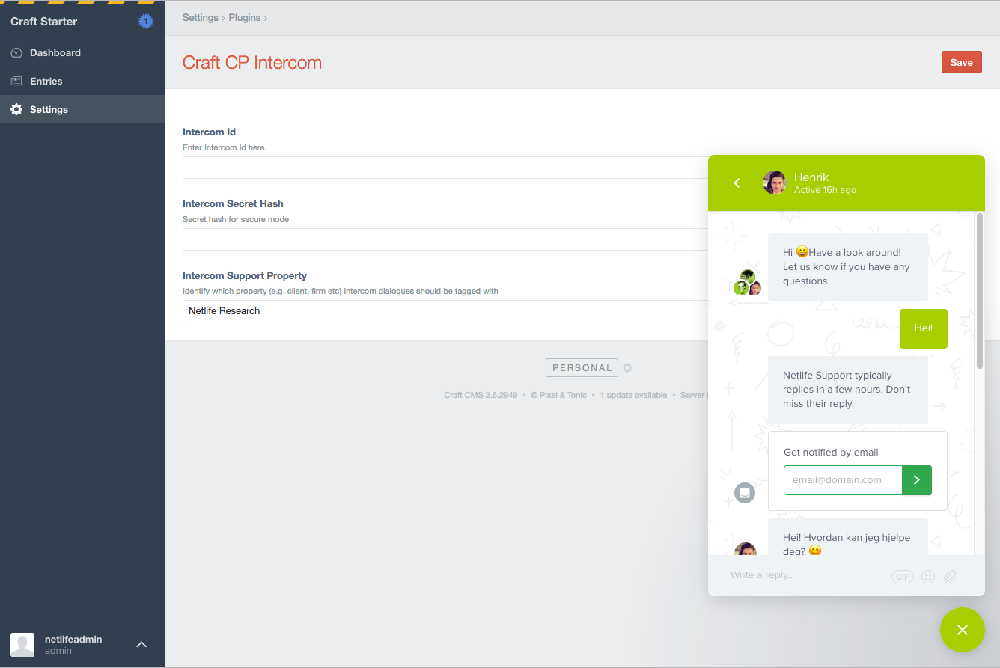

# Craft CP Intercom plugin for Craft CMS

Enable Intercom for logged in users in the Control Panel

## Installation

To install Craft CP Intercom, follow these steps:

1. Download & unzip the file and place the `craftcpintercom` directory into your `craft/plugins` directory
2.  -OR- do a `git clone https://github.com/kmelve/craftcpintercom.git` directly into your `craft/plugins` folder.  You can then update it with `git pull`
3.  -OR- install with Composer via `composer require netliferesearch/craftcpintercom`
4. Install plugin in the Craft Control Panel under Settings > Plugins
5. The plugin folder should be named `craftcpintercom` for Craft to see it.  GitHub recently started appending `-master` (the branch name) to the name of the folder for zip file downloads.

Craft CP Intercom works on Craft 2.4.x and Craft 2.5.x.

## Craft CP Intercom Overview

This plugin enables the Intercom widget in the Craft Control Panel. This is handy if you want to offer support if you are responsible for
clients Craft websites

## Configuring Craft CP Intercom

The plugin needs the Intercom App ID in order to work.

`https://app.intercom.io/a/apps/XXXXXXXX/`

You can also add the Secret Key that Intercom uses for [secure mode](). You'll find it your Intercom App Settings under _secure mode_. This is recommended, but [read the documentation](https://docs.intercom.com/configure-intercom-for-your-product-or-site/staying-secure/enable-secure-mode-on-your-web-product) and make sure you understand the implications.

If you want to be able to segment on company, you can add an identifier for this as well. The company name is usually the way to go.

## Using Craft CP Intercom

Once you have set it up with the Intercom App ID, the widget will appear on the site _for all logged in users_.

## Craft CP Intercom Roadmap

* Choose or create companies in the Control Panel
* Make it available for only certain users/groups
* ~~Release it~~

## Craft CP Intercom Changelog

### 1.0.0 -- 2016.12.09

* Initial release

Brought to you by [Netlife Research](https://github.com/netliferesearch)
